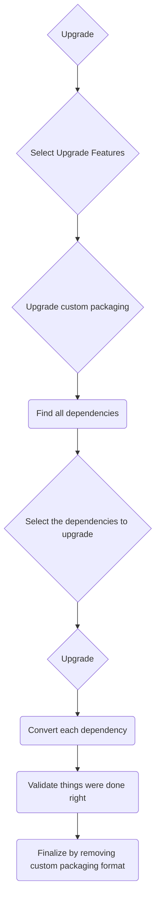

# Custom packaging converter with Upgrade Assistant

This is an example of how to use Upgrade Assistant to convert to PackageReference.

```mermaid
flowchart TD
    A{Upgrade} -->B{Select Upgrade Features}
    B --> C{Upgrade custom packaging}
    C --> D(Find all dependencies)
    D --> E{Select the dependencies to upgrade}
    E --> F{Upgrade}
    F --> G(Convert each dependency)
    G --> H(Validate things were done right)
    H --> I(Finalize by removing custom packaging format)
```
